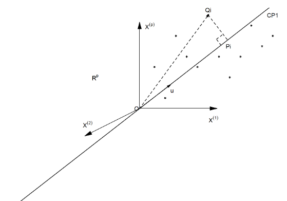

---
output:
  pdf_document:
    highlight: default
    keep_tex: no
    number_sections: yes
    citation_package: natbib  # comentado usa: pandoc-citeproc
    template: latex/plantilla_mma.tex
    pandoc_args: ["--metadata-file=cabecera_capitulos.yaml"]
---

`r xfun::file_string('cabecera_capitulos.tex')`

<!--
```{r include=FALSE}
source("cabecera_chunk_inicio.R")
```
-->

```{r echo=FALSE}
if(!require(pacman)){install.packages("pacman"); library(pacman)}
pacman::p_load("tidyverse", "knitr", "leaps","tidyr","vctrs",
               "exams","leaps","MASS","rsm","car","magrittr")

options(kableExtra.latex.load_packages = F)
knitr::opts_chunk$set(fig.path = 'figurasR/',
                      echo = TRUE, warning = FALSE, message = FALSE,
                      comment = NA,
                      fig.pos="H",fig.align="center",out.width="95%",
                      cache=FALSE) #

knitr::write_bib(c(.packages(),"knitr","rmarkdown"),
                 file="bib/paquetes.bib", width = 60)

#######################################
#exams::include_supplement("myQQnorm.R")
#source("myQQnorm.R")
```


# Marco Teórico

Las técnicas tratadas en el libro \cite{AppliedMultiv2007} xxxxxxxx


## Metodología Utilizada

Para un vector de variables $\underline{\mathbf{x}} = (X_1, \ldots, X_p)'$, dadas las siguientes  Considere combinaciones lineales:

\begin{align}
Y_1 & = \underline{\mathbf{a}}_{\ 1}^T\ \underline{\mathbf{x}} = a_{11}X_1 + \ldots + a_{1p}X_p \nonumber  \\ \nonumber  \\ 
Y_2 & = \underline{\mathbf{a}}_{\ 2}^T\ \underline{\mathbf{x}} = a_{21}X_1 + \ldots + a_{2p}X_p \nonumber  \\  \nonumber  \\  
& \vdots \\ \nonumber  \\ 
Y_p & = \underline{\mathbf{a}}_{\ p}^T\ \underline{\mathbf{x}} = a_{p1}X_1 + \ldots + a_{pp}X_p \nonumber
\end{align}

Es fácil ver que
\begin{align}
\text{Var}[Y_i] & = \underline{\mathbf{a}}_{\ i}^T\  \Sigma \ \underline{\mathbf{a}}_{\ i} \nonumber  \\  \vdots \\
\text{Cov}[Y_i\ ,\ Y_k] & = \underline{\mathbf{a}}_{\ i} \ \Sigma\ \underline{\mathbf{a}}_{\ k}, \ para \ i, k = 1, \ldots, p\ y \ i \neq k \nonumber  
\end{align}

## Proceso para ............. 

El proceso 

## Aspectos a Considerar 

xxxxxxxx 

```{r echo=FALSE, out.width='70%', fig.align='center', fig.cap='Ajuste de Mínimos Cuadrados', fig.pos='H'}

```

### Métodos de Ajustes

xxxxxxxxx 

### Etapa-1


