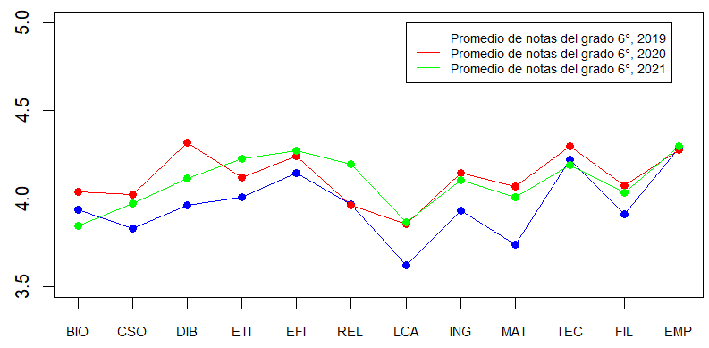
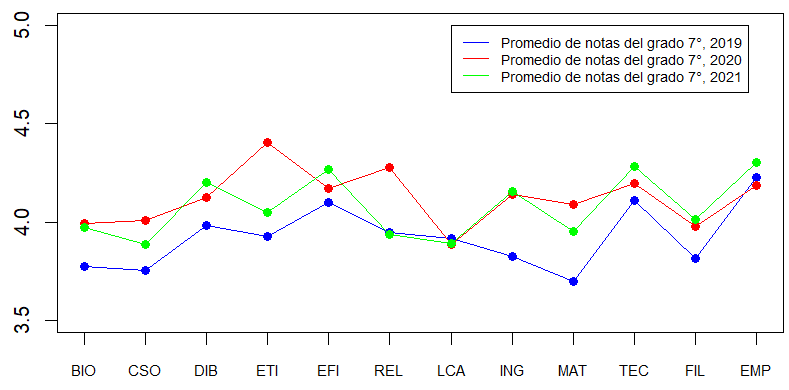

---
output:
  pdf_document:
    highlight: default
    keep_tex: no
    number_sections: yes
    citation_package: natbib  # comentado usa: pandoc-citeproc
    template: latex/plantilla_mma.tex
    pandoc_args: ["--metadata-file=cabecera_capitulos.yaml"]
---

`r xfun::file_string('cabecera_capitulos.tex')`

<!--
```{r include=FALSE}
source("cabecera_chunk_inicio.R")
```
-->

```{r echo=FALSE}
if(!require(pacman)){install.packages("pacman"); library(pacman)}
pacman::p_load("tidyverse", "knitr", "leaps","tidyr","vctrs",
               "exams","leaps","MASS","rsm","car","magrittr")

options(kableExtra.latex.load_packages = F)
knitr::opts_chunk$set(fig.path = 'figurasR/',
                      echo = TRUE, warning = FALSE, message = FALSE,
                      comment = NA,
                      fig.pos="H",fig.align="center",out.width="95%",
                      cache=FALSE) #

knitr::write_bib(c(.packages(),"knitr","rmarkdown"),
                 file="bib/paquetes.bib", width = 60)

#######################################
#exams::include_supplement("myQQnorm.R")
#source("myQQnorm.R")
```


# Resúmen Descriptivo de los Datos

## Tablas de Datos

A continuación xxxxxxxxxxx 

## xxxxxxxxxxx 

### xxxxxxxxxxxx

De la figura \ref{fig:grafica1a} xxxxxxxxx

```{r echo=FALSE, grafica1a, out.width='70%', fig.align='center', fig.cap='Gráfico uno', fig.pos='H'}


```

### xxxxxxxxx 

ver la figura \ref{fig:grafica2a}.

```{r echo=FALSE, grafica2a,out.width='70%', fig.align='center', fig.cap='Gráfico dos', fig.pos='H'}


```

## Análisis de datos de la tarea

A partir de los datos dados en la tabla \ref{tabla-1}.

\begin{table}[!ht]
\caption{Encabezado Datos}
\label{tabla-1}
\bcenter
\begin{tabular}{cccccc}\hline
AÑO            & LC    & MAT   & SOC   & CN    & ING   \\\hline
2019           & 58    & 60    & 55    & 57    & 51    \\
2019           & 63    & 61    & 62    & 66    & 77    \\
2019           & 59    & 66    & 65    & 58    & 79    \\
2019           & 48    & 42    & 43    & 47    & 29    \\
2019           & 61    & 70    & 69    & 72    & 77    \\
.              & .     & .     & .     & .     & .     \\
.              & .     & .     & .     & .     & .     \\
.              & .     & .     & .     & .     & .     \\\hline
\end{tabular}
\ecenter
\end{table}

Se tienen los siguientes análisis.....


