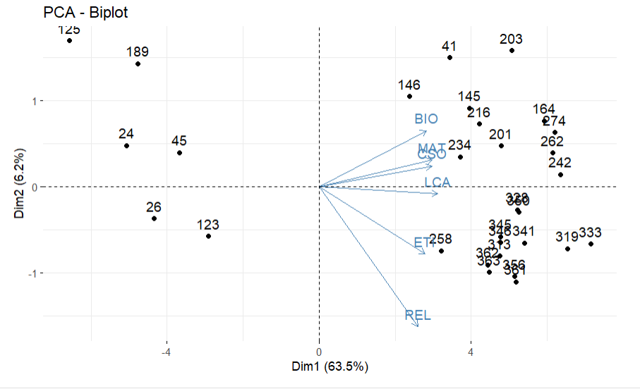

---
output:
  pdf_document:
    highlight: default
    keep_tex: no
    number_sections: yes
    citation_package: natbib  # comentado usa: pandoc-citeproc
    template: latex/plantilla_mma.tex
    pandoc_args: ["--metadata-file=cabecera_capitulos.yaml"]
---

`r xfun::file_string('cabecera_capitulos.tex')`

<!--
```{r include=FALSE}
source("cabecera_chunk_inicio.R")
```
-->

```{r echo=FALSE}
if(!require(pacman)){install.packages("pacman"); library(pacman)}
pacman::p_load("tidyverse", "knitr", "leaps","tidyr","vctrs",
               "exams","leaps","MASS","rsm","car","magrittr")

options(kableExtra.latex.load_packages = F)
knitr::opts_chunk$set(fig.path = 'figurasR/',
                      echo = TRUE, warning = FALSE, message = FALSE,
                      comment = NA,
                      fig.pos="H",fig.align="center",out.width="95%",
                      cache=FALSE) #

knitr::write_bib(c(.packages(),"knitr","rmarkdown"),
                 file="bib/paquetes.bib", width = 60)

#######################################
#exams::include_supplement("myQQnorm.R")
#source("myQQnorm.R")
```


# Métodos Estadísticos Multivariados

En este capítulo xxxxxxxxxx  

## Análisis de Correspondencia Simple

A continuación

\begin{table}[!ht]
\caption{Datos Usados}
\label{tabla1c}
\bcenter
\begin{tabular}{cccccccccccc}\hline
BIO & CSO & DIB & ETI & EFI & REL & LCA & ING & MAT & TEC & FIL & EMP \\\hline
4.3 & 4.1 & 4.2 & 4.5 & 4.1 & 4.7 & 4.1 & 4.3 & 4.2 & 4.5 & 4.4 & 4.4 \\
3.8 & 3.5 & 3.5 & 4 & 3.9 & 3.5 & 3.5 & 3.6 & 3.6 & 3.7 & 3.8 & 4 \\
4.2 & 3.7 & 4 & 4.5 & 4.2 & 4.5 & 3.8 & 4.1 & 3.7 & 4.4 & 4.1 & 4.6 \\
3.8 & 3.6 & 3.5 & 3.5 & 4 & 3.8 & 3.5 & 3.5 & 3.5 & 4 & 3.7 & 3.6 \\
3.9 & 4 & 3.7 & 4 & 4.2 & 4.5 & 3.5 & 3.5 & 3.8 & 4.1 & 3.9 & 4.3 \\
. & . & . & . & . & . & . & . & . & . & . & . \\
. & . & . & . & . & . & . & . & . & . & . & . \\
. & . & . & . & . & . & . & . & . & . & . & .\\\hline
\end{tabular}
\ecenter
\end{table}


```{r, include=FALSE}
library(knitr)
library(magrittr)
library(kableExtra)
# Crea la tabla de valores propios
valores_propios <- data.frame(
  "CP" = c("CP1", "CP2", "CP3", "CP4", "CP5", "CP6"),
  "Valor_Propio" = c(7.6187476, 0.7492153, 0.622638, 0.5808318, 0.4778875, 0.439802),
  "Var_Explicada" = c(63.48956, 6.243461, 5.18865, 4.840265, 3.982396, 3.665016),
  "Acumulado" = c(63.48956, 69.73302, 74.92167, 79.76194, 83.74434, 87.40935)
)

# Utiliza kable() para imprimir la tabla
##kable(valores_propios, align = "cccc", caption = "Tabla de Valores Propios Grado 6°")

knitr::kable(valores_propios, booktabs = TRUE,caption="Tabla de Valores Propios Grado 6",align = 'cccc') %>% 
kableExtra::kable_styling(full_width = F,latex_options = "HOLD_position",  font_size = 10)
```

\begin{table}[!ht]
\caption{Tabla de Valores Propios}
\label{tabla1b}
\bcenter
\begin{tabular}{cccc}\hline
CP & Valor. Propio & Var. Explicada & Acumulado \\\hline
CP1 & 7.6187476 & 63.48956 & 63.48956 \\
CP2 & 0.7492153 & 6.243461 & 69.73302 \\
CP3 & 0.6226380 & 5.188650 & 74.92167 \\
CP4 & 0.5808318 & 4.840265 & 79.76194 \\
CP5 & 0.4778875 & 3.982396 & 83.74434 \\
CP6 & 0.439802 & 3.665016 & 87.40935\\\hline
\end{tabular}
\ecenter
\end{table}

Observando la tabla \ref{tabla1b} xxxxxxxxxxx 

```{r echo=FALSE, grafica1b,out.width='70%', fig.align='center', fig.cap='Gráfico Biblot', fig.pos='H'}


```


De la figura \ref{fig:grafica1b} xxxxxx

## dfadg xxxxxx 


